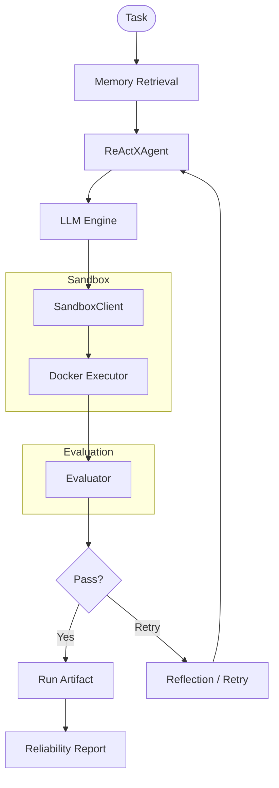

# ReliabilityHarness

AI Reliability Harness for Code Agents

Built on top of the ReActX runtime.

## 面向代码智能体的 AI Reliability Harness

ReliabilityHarness 是一个轻量级 AI Reliability Harness Prototype，
用于研究代码智能体（Code Agents）在执行、失败、重试与恢复过程中的可靠性行为。

项目重点并不是构建一个“通用 Agent Framework”，
而是聚焦：

- Sandbox Execution
- Runtime Failure Capture
- Evaluation-guided Retry
- Failure Taxonomy
- Reflection / Recovery
- Structured Artifact Persistence
- Reliability Reporting

核心理念：

> Task Success ≠ Process Correctness

即：
即使最终答案正确，
Agent 的执行过程也可能包含：

- Runtime Error
- Timeout
- 错误工具使用
- 无效 Retry
- 不稳定恢复行为

因此，
ReliabilityHarness 更关注：

- Agent 为什么失败
- Retry 是否真的有效
- Reflection 是否改善结果
- Memory Retrieval 是否帮助恢复
- 如何保留完整执行证据

---

# System Architecture

```text
Task
  ↓
Agent Runtime
  ↓
Code Generation
  ↓
Sandbox Execution
  ↓
Evaluation
  ↓
Failure Analysis
  ↓
Reflection / Retry
  ↓
Artifact Persistence
  ↓
Reliability Report
```



---

# Current Capabilities

## Runtime & Execution

- Docker-based sandbox execution
- Timeout enforcement
- Runtime error capture
- Structured execution result
- SandboxClient unified execution interface

## Reliability Loop

- Evaluation-guided retry
- Reflection-based retry reasoning
- Metric direction-aware retry effectiveness
- Failure taxonomy
- Recovery tracking

## Memory

- Memory-assisted retry
- Similar failure retrieval
- Failure-fix pattern injection

## Artifact & Reporting

- Structured run artifact persistence
- Retry trace preservation
- Generated code preservation
- stderr / timeout preservation
- Reliability report generation

---

# Example Run Artifact

```json
{
  "task": "Write Python code that prints 42",
  "success": true,
  "num_attempts": 2,
  "memory_used": true,
  "attempts": [
    {
      "attempt_index": 1,
      "generated_code": "print(1 / 0)",
      "runtime_error": true,
      "stderr": "ZeroDivisionError"
    },
    {
      "attempt_index": 2,
      "generated_code": "print(42)",
      "runtime_error": false,
      "stdout": "42\n"
    }
  ]
}
```

---

# Reliability Report

The system can aggregate multiple run artifacts and generate:

- success_rate
- runtime_error_rate
- timeout_rate
- retry_trigger_rate
- recovery_rate
- failure_type_distribution

Generated outputs:

```text
ReActX/reports/reliability_report.json
ReActX/reports/reliability_report.md
```

---

# Project Positioning

This project is NOT:

- a production agent platform
- a general-purpose agent framework
- a multi-agent orchestration system
- a scalable distributed runtime

Instead,
it is:

> A lightweight AI Reliability Harness Prototype
> focused on evaluation-driven recovery behavior
> for code-generating agents.

---

# Repository Structure

```text
ReActX/
├── app/
│   ├── artifacts/
│   ├── reporting/
│   ├── core/
│   ├── loop/
│   ├── memory/
│   └── sandbox_client.py
│
├── sandbox/
├── runs/
├── reports/
├── docs/
├── data/
└── tests/
```

---

# Key Reliability Features

| Feature | Description |
|---|---|
| Sandbox Execution | Docker-isolated code execution |
| Timeout Enforcement | Prevent infinite execution |
| Runtime Error Capture | Preserve stderr and failure evidence |
| Retry Evaluation | Measure retry effectiveness |
| Failure Taxonomy | Categorize runtime / semantic failures |
| Artifact Persistence | Save structured execution traces |
| Reliability Reporting | Aggregate recovery metrics |

---

# Current Focus

Current development focuses on:

- AI reliability engineering
- evaluation-driven retry
- recovery measurement
- failure analysis
- structured execution evidence
- lightweight agent runtime reliability

---

# Future Directions

Potential future directions include:

- stronger failure classification
- trajectory-level evaluation
- process correctness analysis
- reliability benchmark datasets
- lightweight observability
- evaluation-driven agent evolution

---


# ReliabilityHarness

## AI Reliability Harness for Code Agents

ReliabilityHarness is a lightweight AI reliability harness prototype
designed to study the reliability behavior of code-generating agents
during execution, failure, retry, and recovery.

The project is NOT focused on building a general-purpose agent framework.

Instead, it focuses on:

- Sandbox Execution
- Runtime Failure Capture
- Evaluation-guided Retry
- Failure Taxonomy
- Reflection / Recovery
- Structured Artifact Persistence
- Reliability Reporting

Core idea:

> Task Success ≠ Process Correctness

Even if the final answer is correct,
the execution process may still contain:

- Runtime errors
- Timeouts
- Incorrect tool usage
- Ineffective retries
- Unstable recovery behavior

Therefore,
ReliabilityHarness focuses on:

- Why agents fail
- Whether retries actually improve outcomes
- Whether reflection improves recovery
- Whether memory retrieval helps repair failures
- How to preserve execution evidence

---

# System Architecture

```text
Task
  ↓
Agent Runtime
  ↓
Code Generation
  ↓
Sandbox Execution
  ↓
Evaluation
  ↓
Failure Analysis
  ↓
Reflection / Retry
  ↓
Artifact Persistence
  ↓
Reliability Report
```

---

# Current Capabilities

## Runtime & Execution

- Docker-based sandbox execution
- Timeout enforcement
- Runtime error capture
- Structured execution results
- SandboxClient unified execution interface

## Reliability Loop

- Evaluation-guided retry
- Reflection-based retry reasoning
- Metric direction-aware retry effectiveness
- Failure taxonomy
- Recovery tracking

## Memory

- Memory-assisted retry
- Similar failure retrieval
- Failure-fix pattern injection

## Artifact & Reporting

- Structured run artifact persistence
- Retry trace preservation
- Generated code preservation
- stderr / timeout preservation
- Reliability report generation

---

# Example Run Artifact

```json
{
  "task": "Write Python code that prints 42",
  "success": true,
  "num_attempts": 2,
  "memory_used": true,
  "attempts": [
    {
      "attempt_index": 1,
      "generated_code": "print(1 / 0)",
      "runtime_error": true,
      "stderr": "ZeroDivisionError"
    },
    {
      "attempt_index": 2,
      "generated_code": "print(42)",
      "runtime_error": false,
      "stdout": "42\n"
    }
  ]
}
```

---

# Reliability Report

The system aggregates multiple run artifacts and generates:

- success_rate
- runtime_error_rate
- timeout_rate
- retry_trigger_rate
- recovery_rate
- failure_type_distribution

Generated outputs:

```text
ReActX/reports/reliability_report.json
ReActX/reports/reliability_report.md
```

---

# Reliability Evidence Examples

Curated evidence examples are available for reviewing the reliability workflow without running LLMs or Docker:

- [Run Artifact Example](ReActX/docs/examples/example_run_artifact.json)
- [Benchmark Result Example](ReActX/docs/examples/example_benchmark_result.json)
- [Trajectory Analysis Example](ReActX/docs/examples/example_trajectory_analysis.json)
- [Reflection Evaluation Example](ReActX/docs/examples/example_reflection_evaluation.json)
- [Interview Narrative](ReActX/docs/INTERVIEW_NARRATIVE.md)

---

# Project Positioning

This project is NOT:

- a production agent platform
- a general-purpose agent framework
- a multi-agent orchestration system
- a scalable distributed runtime

Instead,
it is:

> A lightweight AI Reliability Harness Prototype
> focused on evaluation-driven recovery behavior
> for code-generating agents.

---

# Repository Structure

```text
ReActX/
├── app/
│   ├── artifacts/
│   ├── reporting/
│   ├── core/
│   ├── loop/
│   ├── memory/
│   └── sandbox_client.py
│
├── sandbox/
├── runs/
├── reports/
├── docs/
├── data/
└── tests/
```

---

# Key Reliability Features

| Feature | Description |
|---|---|
| Sandbox Execution | Docker-isolated code execution |
| Timeout Enforcement | Prevent infinite execution |
| Runtime Error Capture | Preserve stderr and failure evidence |
| Retry Evaluation | Measure retry effectiveness |
| Failure Taxonomy | Categorize runtime / semantic failures |
| Artifact Persistence | Save structured execution traces |
| Reliability Reporting | Aggregate recovery metrics |

---

# Current Focus

Current development focuses on:

- AI reliability engineering
- evaluation-driven retry
- recovery measurement
- failure analysis
- structured execution evidence
- lightweight agent runtime reliability

---

# Future Directions

Potential future directions include:

- stronger failure classification
- trajectory-level evaluation
- process correctness analysis
- reliability benchmark datasets
- lightweight observability
- evaluation-driven agent evolution

---

# Disclaimer

This project is currently a research-oriented engineering prototype.

The focus is reliability experimentation and evaluation workflows,
not production deployment.
